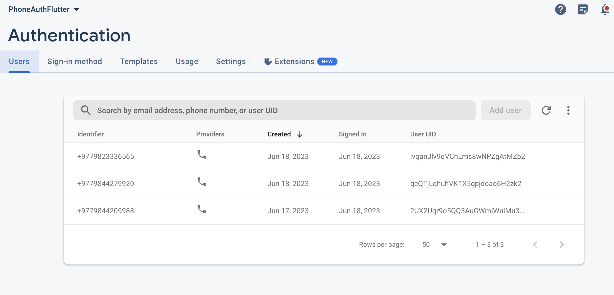

# Flutter-Firebase-Phone-Auth
 This project uses Provider as state management. Here, we first check whether the user is signed in or not. If the user has already signed in then the user is directed to HomeScreen using data from SharedPreferences. If the user has not signed in then Navigation is pushed to Registration Page, where the user provides a phone number and gets OTP. Then the user is checked in our database to confirm if the user is an existing user or a new one. If the User already exists then the user data is fetched from database and save the data to SharedPreferences and redirect to HomeScreen. If the user is new then the userInformation is first stored in Firebase and then to SharedPreferences then Navigate to Home Screen.

## UI

       

## User Authentication via Phone Number

 

## Storing user data in Firestore Database

 

## Storing Profile pic in Firebase Storage

      
